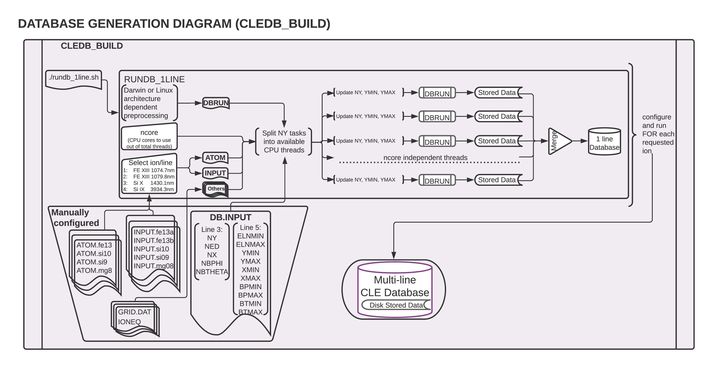

.. _cledb_build-label:

CLEDB_BUILD - Database Generation
=================================

**Purpose:**

The ``CLEDB_BUILD`` module is used to generate a database of synthetic IQUV profiles for the four provisioned ions, with a range of density estimations, range of possible LOS positions, and all possible magnetic angle configurations, for one magnetic field strength B=1.  In normal circumstances this module is only run once per system where the inversion is installed. A module diagram is provided in this section.

CLEDB_BUILD Configuration
-------------------------

 Here we describe the scripts included in the config directory.

``DB.INPUT``
	Main configuration file for the database generation. It contains the configurations for the databases to be generated.

.. Danger::
	It is critical to keep the same number of parameter decimals and white spaces between the values when modifying this file. The automated job-scripts that run the jobs are dependent on precisely reading each variable

``ATOM.ion``
    This set of files contain the atomic configuration data to be used for calculations. These are reduced level calculations that mimic the IQUV fluxes from a full level calculation in the selected infrared coronal lines. 

.. Caution::
	Advanced understanding required. In general, users should not modify these files.
	
``INPUT.ion(a/b)``
	These are input and configuration files that are read when generating databases. The *wlmin* and *wlmax* parameters control which lines described in the ATOM.ion files are processed. In the case of Fe XIII, a separate INPUT configuration (a/b) is needed for each line.

``IONEQ``
	Ionization equilibrium data from CHIANTI.
	
``GRID.DAT``
	Defines the range and resolution of a CLE simulation. In the case of database building it has a very limited functionality and is only required due to CLE's dependency on it.

``db"xxxx"\_"arch"``
	Executable binaries for generating databases. "xxxx" is the current version of the FORTRAN code. arch is "linux", "rclinux" or "darwin". The different versions are provided in the distribution for cross-platform compatibility.	

	* linux -- Debian compiled

	* rclinux -- CentOs compiled on research computing system.

	* darwin -- mac osx x86 compiled.

DB.INPUT parameters
^^^^^^^^^^^^^^^^^^^

``ny, ymin, ymax``
	Number of y (horizontal) heights to compute databases for, in R\ :math:`_\odot` units. The ny heights are spanned between ymin and ymax values. Regardless of user input, polarization signal is not computed for R\ :math:`_\odot` < 1 due to physics of off-limb coronal emission. 

.. attention::
	Observations show that the amount of polarization in Fe XIII drastically decreases with height. One should not normally expect to reasonably recover full Stokes polarization signal at y > 1.5\ :math:`_\odot`.  
	
``ned, elnmin, elnmax``
	Number of ambient electron density values to compute calculations for. elnmin and elnmax define a logarithmic range to spread the ned densities in. The base measurement is an analytical approximation of a standard electron density expected for a y height above the limb. For example, at y = 1.1R\ :math:`_\odot` we expect a logarithm of density log(n\ :math:`_e`) ~ 8 electrons. Setting ned = 10, elnmin = -2 and elnmax = 2 will generate databases for 10 density values logarithmically scaled between log(n\ :math:`_e`) = 6 and log(n\ :math:`_e`) = 10.

.. attention::
	A reasonable density range of log(n\ :math:`_e`) 7-10 is compatible with: 
		
		i. low enough densities so that collisional depolarization becomes unimportant inside the Hanle saturated regime; 
		ii. compatible with expected plasma densities in the 1.0-1.5R\ :math:`_\odot` observation range (also remember above point about polarization vs. height).
	
``nx, xmin, xmax``
	Number of x (depth along the LOS) positions to compute databases for, in R\ :math:`_\odot` units. The nx positions are linearly spanned between xmin and xmax values. 

.. attention::
	Due to geometric considerations, setting xmin and xmax values to more than :math:`\pm` 1.0 R\ :math:`_\odot` will most probably not result in practical benefits. This is because a 1.5 R\ :math:`_\odot` apparent height with a 1.0 R\ :math:`_\odot` depth corresponds to an actual height above the limb of 1.8 R\ :math:`_\odot`. This is in the more extreme range of the polarization formation vs height issue described above.

``nbphi, bpmin, bpmax``
	Number of CLE magnetic los angles to compute. The angles are spread along a 0 - 2\ :math:`\pi` range.
	
``nbtheta, btmin, btmax``	
	Number of magnetic CLE azimuth angles to compute. The range is set to 0 - 1\ :math:`\pi` (reduced range due to spherical transformation).

.. Danger::
	Due to how the problem is posed, please do not interchange the maximum ranges between nbphi and nbtheta, as it would lead to execution errors.	

  

The CLEDB_BUILD Job Script
--------------------------

The *rundb_1line.sh* job script will ingest the ATOM, INPUT, DB.INPUT, etc. files and split the job into available CPU threads. The user is asked for keyboard input on how many threads to use and for which line/ion to generate a database.

The script runs in a bash shell terminal session. It can handle both Linux and Darwin (OSX) environments. For OSX, an additional dependency is required. Users should install the GNU implementation of the sed command. The simplest way is to use the homebrew environment:

.. code-block:: bash

	brew install gnu-sed

The job script will split the serial ny tasks on the requested CPU threads and run in dedicated folders that will be sanitized upon completion, leaving only the output database files and metadata headers. 

Logs for each script ("X") are written in real time and can be checked interactively as the job is running.

.. code-block:: bash

	tail BASHJOB_"X".LOG

A slurm enabled version, *rundb_1line_slurm*  which has hard-coded choices to be compatible with headless runs is also provided. The parameters need to be checked manually before running.

Extensive notes about the parallel job script implementations are found in the additional :ref:`readme-rundb-label` that is also included as standalone .md readme within the ``CLEDB_BUILD`` module.

CLEDB_BUILD Output
------------------

Databases for 1 to 4 of the currently available ions/lines can be constructed by running the job script successively. 

.. tip::
	As long as there are enough available CPU threads available, jobs can be run at the same for **different** ions as there is no storage or computational overlap. 

The output database is written to the storage disk. Each individual line will be written in its dedicated folder. 

.. note::
	Prior to git commit *update-iqud* ``CLEDB_BUILD`` wrote compressed data using a simple float64$\rightarrow$ int16 conversion using a division constant, set to -2.302585092994046e15. Same constant needs to be used when writing but also when reading databases into memory as part of the ``CLEDB_PREPINV`` module. **This proved to create numerical instabilities and was permanently disabled on both writing and reading.**

A database folder hierarchical system is needed in order to ingest the useful database calculations by the ``CLEDB_PREPINV`` module. The folder system is defined as: *element-ionstage_line*.

1. **fe-xiii_1074** 
2. **fe-xiii_1079**
3. **si-x_1430**
4. **si-ix_3934** 

This convention is used by all modules in CLEDB.

.. warning:: 
	Running successive jobs for the **same** ion/line will erase its database contents if they exist! 

Individual data stores for each computed y height are generated to ease I/O operations when reading databases into memory for inverting. A db"xxxx".dat file is generated for each ny height, where "xxxx" represents the distance *above the limb* in units of R\ :math:`_\odot` (DB0000.dat corresponds to the solar limb or a height of 1.00R\ :math:`_\odot`). A metadata db.hdr file is produced in the individual directory that contains the range dimensions and parameters applicable to any one database set of files.
 
.. Danger::
	The user should not change the parameter configurations in ``DB.INPUT`` between multiple ion/line runs that should be part of the same database. 

Generating :math:`\sim` 5 10\ :math:`^8` calculations per line for two lines will occupy :math:`\sim` 32 Gb of disk space (uncompressed storage).