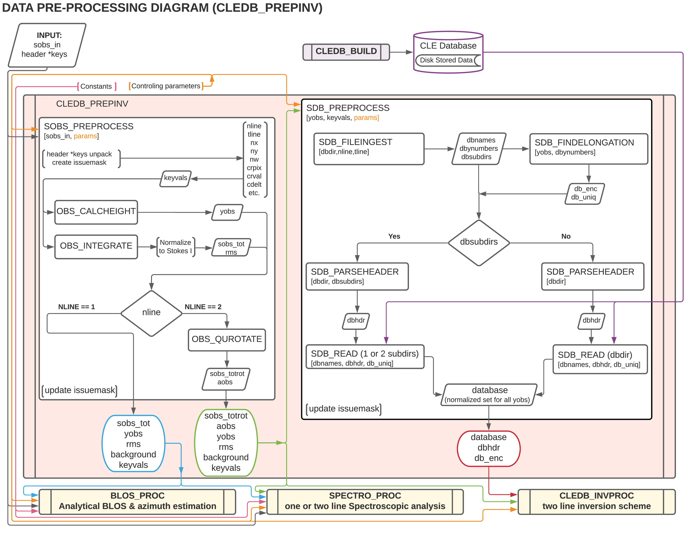

.. _cledb_prep-label:

CLEDB_PREPINV - Pre-processing
=================================

**Purpose:**

The ``CLEDB_PREVINV`` module processes both the input data and the generated databases to prepare for the main inversion processing. 

For 1-line cases, only the observation is pre-processed. Observation keywords are ingested, the geometric height is computed and the spectroscopic IQUV profiles are integrated. 

In addition for 2-line observations, the observation linear polarization is rotated to match the database calculation as described in `Paraschiv & Judge, SolPhys, 2022 <https://ui.adsabs.harvard.edu/abs/2022SoPh..297...63P/abstract>`_. The module then performs a height match between the input data and database configuration. Only the optimal subset of database entries are pre-loaded into memory to minimize I/O operations but also to avoid I/O bottlenecks when running the analysis routines in the ``CLEDB_PROC`` module. 

CLEDB_PREPINV Module Functions
------------------------------
.. note::
    The :math:`\diamond` and :math:`\triangleright` symbols respectively denote main and secondary/tertiary functions. Main functions are called by the example scripts. Secondary functions are called by the main functions, and tertiary from secondary functions.

.. _sobs_preprocess-label:

:math:`\diamond` **SOBS_PREPROCESS**
    Main function to process an input observation and ingest the relevant keywords. Generally, this function iterates over the observation maps and sends each voxel to the internal functions. It returns a processed observation array (input dependent) that is ready for analysis. Additional products are calculated. e.g. a height map (used to match databases), signal statistics, etc via subfunctions.  

    :math:`\triangleright` OBS_CALCHEIGHT
        Calculates height map of the same xy dimensions as the input array. each pixel encodes the solar height in units of R\ :math:`_\odot`.

    :math:`\triangleright` OBS_INTEGRATE
        Estimates background counts using a cumulative distribution function (CDF) statistical method, then integrates along the wavelength dimension, in all IQUV components of all input lines. Profile integration is required because the database dimensionality and inversion computational times would not be feasible when processing full spectra observations. See `Paraschiv & Judge, SolPhys, 2022 <https://ui.adsabs.harvard.edu/abs/2022SoPh..297...63P/abstract>`_ for extended information.  

        :math:`\triangleright\triangleright` OBS_CDF 
            Computes the CDF distribution from one voxel spectra. 

    :math:`\triangleright` OBS_QUROTATE
        If ingested a 2-line observation, the Stokes Q and U components are rotated to match the database's reference direction for linear polarization (The reference direction should be read as input from the header information). This enables using just a 1D database computation (along y heights) to match the any observed Stokes profiles in a 2D map with these applied rotational transforms. See `Paraschiv & Judge, SolPhys, 2022 <https://ui.adsabs.harvard.edu/abs/2022SoPh..297...63P/abstract>`_ for extended information. 
  
:math:`\diamond` **SDB_PREPROCESS**
    Main function for selecting and reading into memory the optimal database calculations that are compatible with the observations processed via ``SOBS_PREPROCESS``.

    :math:`\triangleright` SDB_FILEINGEST
        Globs the database directory to deduce what database heights are present and process their configuration from the metadata headers.

    :math:`\triangleright` SDB_FINDELONGATION
        Compares the database entries (along ny) with the heights covered by the observation and minimizes the number of database DBXXXX.dat files to be read into memory.

    :math:`\triangleright` SDB_PARSEHEADER
        Parses the database header information from the db.hdr file.         

        :math:`\triangleright\triangleright` SDB_LCGRID
            Computes the grid spacing for the logarithm of density ranges covered in the database. The grid is correspondent to the density values in the database calculations.

    :math:`\triangleright` SDB_READ
        Reads all needed database files. This concludes all the disk I/O operations done during one run of the inversion.                         

The ``CLEDB_PREPINV`` module is not fully compatible with Numba non-python mode, due to disk I/O operations. All non-python compatible functions are enabled in non-python mode while the rest are compiled with the "forcedobj=True" flag. The algorithm flow is described in the below diagram.

CLEDB_PREPINV Main Variables
----------------------------

.. _sobs_tot-label:

``sobs_tot [xs,ys,nline*4] float array``
    Contains the background subtracted, integrated, and normalized Stokes IQUV spectra for 1-line ([xs,ys,4]) or 2-line ([xs,ys,8]) observations. 

.. _sobs_totrot-label:

``sobs_totrot [xs,ys,nline*4] float array``
    Derived from *sobs_tot*, where the QU components are rotated along the center of the Sun to match the reference direction for linear polarization (the reference in which the database is created by ``CLEDB_BUILD``). In inner functions of ``CLEDB_PROC`` only 1 pixel is passed at a time as *sobs_1pix*. The variable is initialized as a "zero" array that is returned in the case of 1-line observations to keep a standardized function input/output needed for Numba vectorization.    

``background [xs,ys,nline*4] float array`` 
	Returns averaged background counts for each voxel and each Stokes component. 

``rms [xs,ys,nline*4] float array``
    Returns the root mean square (rms) of the total counts in each Stokes profile. The rms calculation is correspondent to the ratio between intensity in the line core and background counts (the variance). This measurement shows the quality in the signal for a particular voxel.

.. _yobs-label:

``yobs [xs,ys] float array``
    The header keyword input is used to construct a height projection for each observed voxel in units or R\ :math:`_\odot`. In inner functions of ``CLEDB_PROC`` only 1 pixel is passed at a time as *yobs_1pix*.

``aobs [xs,ys] float array``
    Stores the linear polarization angle transformation performed by the ``OBS_QUROTATE`` function. This information is used to derotate the matched database profiles found by the ``CLEDB_INVPROC`` 2-line inversion module. In inner functions of ``CLEDB_PROC`` only 1 pixel is passed at a time as *aobs_1pix*. The variable is initialized as a "zero" array that is returned in the case of 1-line observations as needed for Numba vectorization.    .

``dbsubdirs [string] or [string list]``
    Contains the directory structure formatted as described in the CLEDB\_BUILD output section.

``database [ned,nx,nbphi,nbtheta,nline*4] list of float arrays``
    The list is the minimal subset of databases that are compatible with the observation taking to account the ny resolution of the database.        

``dbhdr [ints, floats and strings] list``
    Database header information containing the parameters used to generate the database.  

.. _dbenc-label:

``db_enc [xs,ys] float array``
    Keeps an encoding of which of the memory loaded databases (element in list) to use for matching in each voxel.          

``issuemask [xs,ys] float array``
    An array that encodes issues appearing during processing of all modules. The :ref:`issuemask-label` is described separately.        
  
.. Note::
    Input variables, e.g. header \*keys, sobs_in, ctrlparams, constants, etc. that are described in :ref:`inputvars-label` are not repeated in this section.                                  
