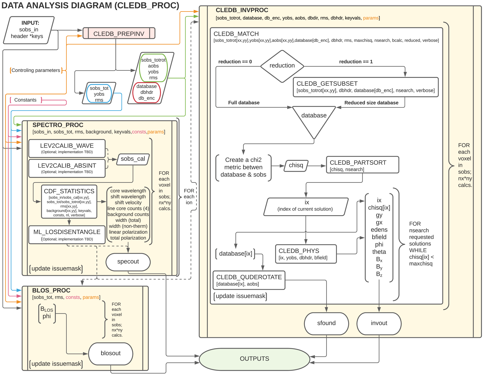

.. _cledb_proc-label:

CLEDB_PROC - Analysis \& Inversion
=======================================

**Purpose:**

Three main functions, **SPECTRO_PROC**, **BLOS_PROC**, and **CLEDB_INVPROC** are grouped under the ``CLEDB_PROC`` data analysis and inversion module. Based on the 1-line or 2-line input data, two or three modules are called. Line of sight or full vector magnetic field outputs along with plasma, geometric and spectroscopic outputs are inverted here. The algorithm flow and a processing overview is described in the flowchart. 

The SPECTRO_PROC Function
-------------------------

**Purpose:**

Ingests the full prepped data from :ref:`sobs_preprocess<sobs_preprocess-label>` and produces spectroscopic outputs for each input line. Part of the outputs are used downstream in **BLOS_PROC** or **CLEDB_INVPROC**. This module requires data in the formats as resulting from the ``CLEDB_PREPINV`` module. Optional sub-modules are envisioned to be integrated into this processing based on upstream instrument processing and retrieved data quality. This is an execution time consuming function.

.. note::
    The :math:`\diamond` and :math:`\triangleright` symbols respectively denote main and secondary/tertiary functions. Main functions are called by the example scripts. Secondary functions are called by the main functions, and tertiary from secondary functions.

SPECTRO_PROC Main Functions
^^^^^^^^^^^^^^^^^^^^^^^^^^^
:math:`\diamond` **SPECTRO_PROC**

    :math:`\triangleright` CDF_STATISTICS
        Performs analysis on the stokes IQUV spectra for each line and computes relevant spectroscopic outputs (see input/output variable descriptions below) by using gaussian fitting coupled with non-parametric approaches, namely the analysis of cumulative normal distribution functions.

    .. note::
        Two helper routines, OBS_CDF and OBS_GAUSSFIT are used by CDF_STATISTICS to perform parameter fits and estimations.

    :math:`\triangleright` ML_LOSDISENTANGLE (Opt.)
        Provisioned to be implemented at a later time. Uses Machine learning techniques for population distributions to help disentangling multiple emitting structures along the LOS in situations where the single point assumption might fail.

    :math:`\triangleright` LEV2CALIB_WAVE (Opt.)
        Provisioned to be implemented at a later time. Higher order wavelength calibration using the spectroscopic profiles. See `Ali, Paraschiv, Reardon, & Judge, ApJ, 2022 <https://ui.adsabs.harvard.edu/abs/2022ApJ...932...22A/abstract>`_ for additional details. This function can couple if the upstream wavelength accuracy of the input observation is missing or is less than 0.01nm.

    .. important::
        Upstream Level-1 calibration for DKIST is provisioned to match or exceed this accuracy requirement. Implementation is of low priority.

    :math:`\triangleright` LEV2CALIB_ABSINT (Opt.)
        To be implemented at a later time, if feasible. Absolute intensity calibration function that produces an additional output, the calibrated intensity in physical units. The approach is not easily automated as it requires a more convoluted and specific planning of the observations to gather the necessary input data.   

.. important::
    This functions was provisioned in the incipient stages of the pipeline design. Subsequently, it was found that CLEDB can work with normalized Stokes profiles such that absolute calibrations are not required. Implementation is halted at this time.

SPECTRO_PROC Main Variables
^^^^^^^^^^^^^^^^^^^^^^^^^^^

``sobs_cal [nx,ny,sn,4] float array (opt.)`` 
    Optional calibrated level-2 data in intensity and or wavelength units. This would then be used by the CDF_STATISTICS function instead of sobs_in.                 	

.. note::
    As LEV2CALIB_ABSINT and LEV2CALIB_WAVE are not implemented, sobs_cal is currently just a placeholder.

.. _specout-label:  

``specout [nx,ny,nline,12] output float array`` 
	Returns 12 spectroscopic output products, for each input line and for every pixel location.

    * specout[:, :, :, 0] 
        Wavelength position of the line core; nm units.
    
    * specout[:, :, :, 1] 
        Doppler shift with respect to the theoretical line core defined in the :ref:`constants class<consts_lref-label>`\ ; nm units.
    
    * specout[:, :, :, 2]
        Doppler shift with respect to the theoretical line core defined in the :ref:`constants class<consts_lref-label>`\ ; km s\ :math:`^{-1}` units.
    
    * specout[:, :, :, 3:7] 
        Intensity at line center wavelength for Stokes I, Q, and U. Stokes V intensity is given as the maximum or minimum counts in the core of the first (left) lobe. Thus, the Stokes V intensity measurement will not match the wavelength position of the Stokes IQU intensities; ADU units or calibrated physical units if LEV2CALIB_ABSINT is utilized.

    * specout[:, :, :, 7]
        Averaged background intensity outside the line profile for the Stokes I component. Since background counts are independent of the Stokes measurement, we utilize just this one realization; ADU units or calibrated physical units if LEV2CALIB_ABSINT is used.

    * specout[:, :, :, 8]
        Total line full width at half maximum (FWHM); nm units.
    
    * specout[:, :, :, 9]
        Non-thermal component of the line width. A measure or estimation of the instrumental line broadening/width will significantly increase the accuracy of this determination; nm units.
    
    * specout[:, :, :, 10]
        Fraction of linear polarization (P\ :sub:`l`) with respect to the total intensity; dimensionless.                              
    
    * specout[:, :, :, 11]
        Fraction of total polarization (linear+circular P\ :sub:`v`) with respect to the total intensity; dimensionless.

.. Attention::
	Regardless if solving for 1-line or 2-line observations, specout will return two nline dimensions. In the case of 1-line observations, the dimension corresponding to the second line remains just 0 all throughout. The unused dimension can be removed from the upstream script, if needed. This behavior is known and enforced to keep output casting static, making the codebase compatible with Numba and speeding up execution.

The BLOS_PROC Function
----------------------

 .. error::
    Stokes V observations are required for this analytical method. Thus, BLOS_PROC is incompatible with the IQUD input.

**Purpose:**

Implements analytical approximations of `Casini & Judge, ApJ, 1999 <https://ui.adsabs.harvard.edu/abs/1999ApJ...522..524C/abstract>`_ and `Dima & Schad, ApJ, 2020 <https://ui.adsabs.harvard.edu/abs/2020ApJ...889..109D/abstract>`_ to calculate the LOS projected magnetic field strength and magnetic azimuth angle. The module returns two degenerate constrained magnetograph solutions, where the one that matches the sign of the atomic alignment is more precise. The less precise "classic" magnetograph formulation is also provided.

.. attention::
    There is not enough information in 1-line observations to deduce which of the two degenerate solution is "more precise". The "classic" magnetograph estimation is less precise than the optimal degenerate constrained magnetograph solution, but more precise than the other.
    The differences will vary from insignifiant to tens of percents of the fieldstrength based on observation and magnetic geometry and degree of linear polarization. The choice of what product to use remains with the user. 

This branch requires only 1-line observations (4 stokes profiles). It is used to get as much magnetic information as possible (the field strength and LOS projection) in the absence of a second line. For a :ref:`sobs_tot <sobs_tot-label>` input of 2-lines, the module will produce independent products for each input observation.

.. hint::
    Observations of Si X 1430.10 nm will benefit from an additional alignemnt correction due to the non-zero F factor of this transition. Additional details in `Dima & Schad, ApJ, 2020 <https://ui.adsabs.harvard.edu/abs/2020ApJ...889..109D/abstract>`_.

BLOS_PROC Main Functions
^^^^^^^^^^^^^^^^^^^^^^^^

:math:`\diamond` **BLOS_PROC**

BLOS_PROC Main Variables
^^^^^^^^^^^^^^^^^^^^^^^^

.. _blos-label:

``blosout [nx,ny,4*nline] output float array``
    The array returns 4 or 8 products containing line of sight projected magnetic field estimations and magnetic azimuth angle in G units at each pixel location.
   
    * blosout[:, :, 0] and/or blosout[:, :, 4]
        First degenerate constrained magnetograph solution for each respective line. 
        
    * blosout[:, :, 1] and/or blosout[:, :, 5]
        Second degenerate constrained magnetograph solution for each respective line.
        
    * blosout[:, :, 2] and/or blosout[:, :, 6] 
        "Classic" magnetograph solution for each respective line. Values lie in between the two above degenerate solutions. 

    * blosout[:, :, 3] and/or blosout[:, :, 7]
        Magnetic field azimuth angle derived from the Q and U linear polarization components of the respective line; -:math:`\pi` to :math:`\pi` range.

.. warning::
    A :math:`\frac{\pi}{2}` degeneracy will manifest due to using arctan functions to derive the angle.

The CLEDB_INVPROC Function
--------------------------

**Purpose:**

Main 2-line inversion function. **CLEDB_INVPROC** compares the preprocessed observations with the selected databases by performing a :math:`\chi^2` goodness of fit measurement between each independent voxel and the complete set of calculations in the matched database. If **CLEDB_GETSUBSET** is enabled via :ref:`ctrlparams<ctrl-label>` class :ref:`getsubset key<ctrl_red-label>`, a presorting of the database entries to those that match the direction of lienar polarization is performed. After the main sorting is performed, the best database solutions are then queried with respect to the physical parameters that gave the matched profiles. 

.. caution::
    The :ref:`reduced<ctrl_red-label>` presorting will slightly change the final ordering of solutions in certain cases.

CLEDB_INVPROC Main Functions
^^^^^^^^^^^^^^^^^^^^^^^^^^^^

:math:`\diamond` **CLEDB_INVPROC**
    Observation array iterator and variable ingestion for CLEDB_MATCHIQUV or CLEDB_MATCHIQUD.

:math:`\diamond` **CLEDB_MATCHIQUV**
	Matches a set of two full Stokes IQUV observations with a model observation of the same Stokes quantities. Matching is done individually for one pixel in the input array. This is an execution time consuming function.  

:math:`\diamond` **CLEDB_MATCHIQUD**
    Matches a set of two partial Stokes IQU observations with a model observation of the same Stokes quantities. The matched solutions are more degenerate (usually 4 times) than CLEDB_MATCHIQUV. Additional information from Doppler oscillation tracking are brought-in to recover field strengths and reduce degeneracies (to 2 times). Matching is done individually for one pixel in the input array. This is an execution time consuming function.

    .. note::
        Based on the ctrlparams :ref:`iqud key<ctrl_iqud-label>` one of CLEDB_MATCHIQUV or CLEDB_MATCHIQUD setups is selected.

    
    :math:`\triangleright` CLEDB_GETSUBSET
        When :ref:`enabled<ctrl_red-label>`, the information encoded in the Stokes Q and U magnetic azimuth is used to reduce the matched database by approximately 1 order of magnitude in terms of calculations.

    .. important::
        If the subset calculation is :ref:`enabled<ctrl_red-label>` via :ref:`ctrlparams<ctrl-label>`, execution time in the case of large databases is significantly decreased

    :math:`\triangleright` CLEDB_PARTSORT
	   A custom function that performs a partial sort of the input array because only a small subset of solutions are requested via the :ref:`nsearch key<ctrl_nsearch-label>`. This increases execution times by a few factors when requesting just few solutions (<100 on 10\ :math:`^8` entries databases). CLEDB_PARTSORT is used by CLEDB_MATCHIQUV, CLEDB_MATCHIQUD, and CLEDB_GETSUBSET functions. In CLEDB_MATCH, CLEDB_PARTSORT performs a < *nsearch* sorting of database entries based on the :math:`\chi^2` metric. In CLEDB_GETSUBSET, CLEDB_PARTSORT selects for each :math:`\phi` angle orientation only the most compatible :math:`\theta` directions based on the :math:`\Theta_B` azimuth given by the linear polarization Q and U measurements.
    
    :math:`\triangleright` CLEDB_PHYS
        Returns 9 physical and geometrical parameters corresponding to each selected database index following the nsearch and maxchisq constraints. These are described below.

    .. note::
        CLEDB_PHYS is propped by a number of helper routines, CLEDB_PARAMS, CLEDB_INVPARAMS, CLEDB_ELECDENS, and CLEDB_PHYSCLE that provide interfaces with the parameters encoded in selected databases and help transform quantities between different geometrical systems.

    :math:`\triangleright` CLEDB_QUDEROTATE
        Derotates the Q and U components from each selected database entry, in order to make the set of measurements comparable with the original integrated input observation.                        

CLEDB_INVPROC Main Variables
^^^^^^^^^^^^^^^^^^^^^^^^^^^^

``database [ned,nx,nbphi,nbtheta,nline\*4] list of float arrays``
    Individual list entries are fed to the CLEDB_MATCHIQUV or CLEDB_MATCHIQUD. From the database list, only the best matching height entry via :ref:`db_enc<dbenc-label>` is passed via the *database_sel* internal variable. 

``database_sel [ned,nx,nbphi,nbtheta,nline\*4] float array``  
    Subset index of the database list that is fed to CLEDB_MATCHIQUV or CLEDB_MATCHIQUD for matching the observation in one voxel. This alleviates memory shuffling and array slicing operations. The array is then reshaped into a 2D  [ned\*nx\*nbphi\*nbtheta(index),nline\*4] form. In the case where reduction is selected, database_sel is additionally reduced with respect to the number of potential indexes to match. 

``sobs_totrot``
    Input variable to CLEDB_INVPROC described :ref:`here<sobs_totrot-label>`.

``sobs_dopp``
    Doppler oscillation magnetic field strength and POS orientation resulting from wave tracking.

.. caution::
    *sobs_dopp* is only used as part of CLEDB_MATCHIQUD. For Numba consistency, an empty array is also passed to CLEDB_INVPROC when performing full IQUV inversions, but it is never used.

``chisq [ned\*nx\*nbphi\*nbtheta,nline\*4] float array``
     Computes the squared difference between the voxel [nline\*4] IQUV measurements and each index element of the database [index,nline\*4].

``sfound [nx,ny,nsearch,nline\*4] output float array;``
     Returns the de-rotated and matched nsearch IQUV\*nline Stokes IQUV sets from the database.

.. _invout-label:

``invout [nx,ny,nsearch,11] output float array`` 
    Main 2-line inversion output products. invout contains the matched database index, the :math:`\chi^2` fitting residuals, and 9 inverted physical parameters, for all nsearch closest matching solutions with respect to the input observation. The 11 parameters follow with individual descriptions.

    * invout[:,:,:,0] 
        The index of the database entry that was matched at the nsearch rank. The index is used to retrieve the encoded physics that match the observations.
    
    * invout[:,:,:,1]
        The :math:`\chi^2` residual of the matched database entry.

    * invout[:,:,:,2] 
        Plasma density computed via the database. This output is applicable for the Fe XIII 1074.68/1079.79 line ratio (same ion). Other line combinations will produce less accurate results due to the relative abundance ratios, that are varying dynamically. For a real-life observation, we do not consider trustworthy the implicit static relative abundance ratios of different ions, resulted from the CHIANTI base tabular data ingested from the ATOM files to build databases. Units are logarithm of number electron density in cm\ :math:`^{-3}`.

    * invout[:,:,:,3]
        The apparent height of the observation. Analogous to the :ref:`yobs<yobs-label>` variable; R\ :math:`_\odot` units.
    * invout[:,:,:,4]
        Position of the dominant emitting plasma along the LOS; R\ :math:`_\odot` units. 
    * invout[:,:,:,5]
        Magnetic field strength recovered via the ratio of observed stokes V to database Stokes V (computed for B = 1 G); Uses ctrlparam class :ref:`bcalc key<ctrl_bcalc-label>`; G units.

        .. warning::
            Due to how the problem is posed, CLEDB_MATCHIQUV can only use bcalc = 0, 1, or 2 while CLEDB_MATCHIQUD can only use bcalc = 3.

    * invout[:,:,:,6]
        Magnetic field LOS angle in CLE frame; 0 to :math:`2\pi` range.

    * invout[:,:,:,7]
        Magnetic field azimuth angle in CLE frame; 0 to :math:`\pi` range.

    * invout[:,:,:,8]
        B\ :sub:`x` cartesian projected magnetic field depth/LOS component; G units.

    * invout[:,:,:,9]
        B\ :sub:`y` cartesian projected magnetic field horizontal component; G units.

    * invout[:,:,:,10]
        B\ :sub:`z` cartesian projected magnetic field vertical component; G units.

.. attention::
   Regardless of the number of solutions (if any) that are found inside the maxchisq and nsearch constraints, the invout array will keep its dimensions fixed by nsearch and return "0" value fields, with only the index set to "-1" to keep output data shapes consistent. This is a Numba requirement. 	                        