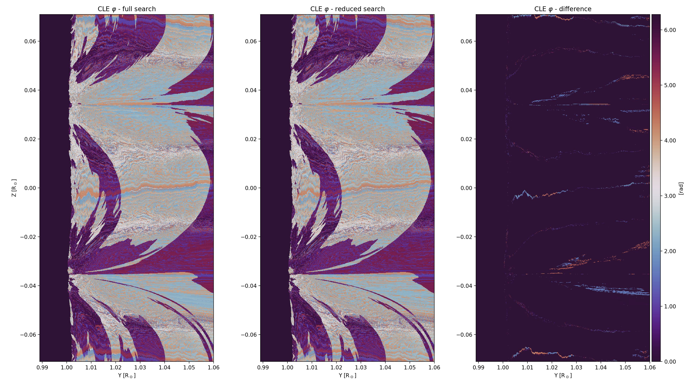

.. _inputvars-label:

Input Variables and Parameters
==============================

Input Data and Metadata
-----------------------

``header *keys``
	Set of input :term:`header` metadata information that should describe the ``sobs_in`` :ref:`variable <sobs_in-label>`. Expected keywords with simplified naming are detailed in this section. Detailed keyword information can be found for DKIST observations in the `SPEC_0214 documentation <https://docs.dkist.nso.edu/projects/data-products/en/stable/specs/spec-214.html>`_ and the `uCoMP documentation <https://mlso.hao.ucar.edu/files/UCoMP-Data-User's-Guide-for-Distrubtion_Web_2023nov29.pdf>`_ .

	``*keys to crpixn [] int``
	Reference pixel along x y or w (wavelength) direction.

	``*keys to crvaln [] float``
	Coordinate value at crpix along x y or w (wavelength) direction.

	``*keys to cdeltn [] float``
	Spatial (x,y) or spectral (w) platescale sampling along a direction.

	``*keys to linpolref [] float``
	(0, 2\ :math:`{\pi}`) range; Direction of database reference for the linear polarization. ``linpolref`` = 0 implies the direction is corresponding to a horizontal axis, analogous to the unit circle reference. Direction is trigonometric. The units are in radians. This is controlled via *ctrlparams*.

	``*keys to instwidth [] float``
	Measure of the utilized instrument's intrinsic line broadening coefficient. The units are in nm. This is controlled via *ctrlparams*.

	``*keys to nline [] int``
	Number of targeted lines; CLEDB can accept 1-line or 2-line observations.

	``*keys to tline [:12, nline] string array``
	String array containing the name of lines to process. Naming convention follows the database :ref:`directory structure <naming_conv-label>` defined as part of the ``CLEDB_BUILD`` module.

	``*keys to xs/naxis1 [] int``
	Pixel dimension of ``sobs_in`` array along the horizontal spatial direction.

	``*keys to ys/naxis2 [] int``
	Pixel dimension of ``sobs_in`` array along the vertical spatial direction.

	``*keys to ws [] int``
	Pixel dimension of ``sobs_in`` array along the spectral dimension.

	``*keys to linpolref [] float``
	Usually points to a control parameter defining the orientation reference for linear polarization.

	``*keys to instwidth [] float``
	 If instrumental width can be quantified and is significant, it gets recorded in this variable.

	``*keys to hpxycoords [] fltarr``
	 Header metadata is fed to the WCS system to compute the spatial map of a slit raster observation.

	``*keys to wlarr [] fltarr``
	 Header metadata is fed to the WCS system to compute the spectral dispersion coefficients of a slit.

``keyvals [17] list of header variables``
	Packing of nx, ny, nw, nline, tline, crpix1, crpix2, crpix3, crval1, crval2, crval3, cdelt1, cdelt2, cdelt3, linpolref, instwidth, hpxycoords, wlarr in a list container to more easily feed the necessary keywords and fitted axes to other modules and/or functions.

.. _sobs_in-label:

``sobs_in [nline][xs,ys,ws,4] float array; nline = 1 || 2 for (1-line) or (2-line)``
    ``sobs_in`` is passed as a `numba typed list <https://numba.readthedocs.io/en/stable/reference/pysupported.html#typed-list>`_ at input. Data are input Stokes IQUV observations of one or two lines respectively. The list will be internally reshaped as a numpy float array of [xs,ys,ws,4] or [xs,ys,ws,8] size.

.. _ctrl-label:

Ctrl. Parameters *ctrlparams.py* Class
--------------------------------------

.. literalinclude:: ../../ctrlparams.py
   :language: PYTHON

Python class that unpacks control parameters used in all modules of the inversion setup. This is an editable imported module that users access and modify. The yaml import seen here is used to configure Numba global options.

.. hint::
	The python importlib module is used in the example notebooks to reload changes.

General Parameters
^^^^^^^^^^^^^^^^^^

.. _ctrl_dbdir-label:

``dbdir [] string``
	Directory where the database is stored after being built with ``CLEDB_BUILD``. This is the main directory containing all ions, and not one of the individual ion subdirectories (e.g. fe-xiii_1074, etc.).

.. _verbosity-label:

``verbose [] uint``
	Verbosity controlling parameter that takes vales 0-3. Levels are incremental (e.g. lev 3 includes outputs from levels 1 and 2).

	* verbose == 0: **Production** - Silent run.

	* verbose == 1: **Interactive Production** - Prints the current module, basic information, and loop steps along with operations currently being run. Global errors will produce a message.

	* verbose == 2: **Debug** - Enables additional warnings for common caveats and error messages. This will also enable execution timing for selected sections.

	* verbose == 3: **Heavy Debug** - Will reveal the pixel being run along with any issues or warnings detected at the pixel level. Output will be hard to navigate!

PREPINV Parameters
^^^^^^^^^^^^^^^^^^

``integrated [] boolean``
	To use for calibrated COMP/UCOMP data. In this case, the profiles are integrated across the line sampling points. This parameter defaults to 0 to be applicable to spectroscopic data such as DKIST.

``dblinpolref [] rad``
	Assign the database reference direction of linear polarization. Angle direction is trigonometric. Values are in radians; e.g. 0 for horizontal ->0deg; np.pi/2 for vertical ->90deg rotation in linear polarization QU. `Paraschiv & Judge, SolPhys, 2022 <https://ui.adsabs.harvard.edu/abs/2022SoPh..297...63P/abstract>`_ and the `CLE <https://github.com/arparaschiv/coronal-line-emission>` database building functions conventionally use a vertical direction for the direction used in computing the database (at Z=0 plane) of dblinpolref =0. See CLE routine db.f line 120. If the database building reference direction is changed, this parameter needs to match that change.

``instwidth [] nm``
	Instrumental line broadening/width in nm units should be included here if known. It is not clear at this point if this will be a constant or a varying keyword for one instrument. Setting a instwidth = 0 value will skip including an instrumental contribution when computing non-thermal widths (:ref:`specout[:,:,:,9]<specout-label>`) output in the :ref:`SPECTRO_PROC <cledb_spectro-label>` module.

	``atmred [] boolean``
	 Flag to reduce atmospheric and photospheric lines present in spectral data using curated spectral atlases. Useful for reducing DKIST Cryo-NIRSP Level 1 data. This can be applied only to Stokes I at the moment. Dedicated information on the photospheric `(link) <https://mark4sun.jpl.nasa.gov/toon/solar/solar_spectrum.html>`_ and telluric `(link) <https://github.com/tschad/dkist_telluric_atlas/atlases>'_ can be found online.

.. Warning::
	Currently atmred does not correct for line polarization effects and residual cross-talk in Stokes QUV data. Beware when interpreting and integrating polarization profiles.

PROC Parameters
^^^^^^^^^^^^^^^

.. _ctrl_nsearch-label:

``nsearch [] uint``
	Number of solutions to compute and return for each pixel.

.. _ctrl_maxchisq-label:

``maxchisq [] float``
	Stops searching for solutions in a particular pixel if fitting residuals surpassed this threshold.

.. _ctrl_gaussfit-label:

``gaussfit [] uint``
	Used to switch between CDF fitting and Gaussian parametric fitting with optimization.

	* gaussfit == 0: Process the spectroscopic line parameters using only the CDF method.

	* gaussfit == 1: Fit the line using an optimization based Gaussian procedure. This approach requires a set of 4 guess parameters. These are the approximate maximum of the emission (max of curve), the approximate wavelength of the core of the distribution(theoretical center of the line), its standard deviation (theoretical width of 0.16 nm), and an offset (optional, hard-coded as 0).

	* gaussfit == 2: (Default) Fit the line using a optimization based Gaussian procedure. In this case, the initial guess parameters are fed in from the results of the CDF solution. In this case, the curve fitting theoretically optimizes for a more accurate solution, with sub-voxel resolution.

.. _ctrl_bcalc-label:

``bcalc [] uint``
	Controls how to compute the field strength in the case of 2-line observations.

	* bcalc == 0: Use the field strength ratio of the first coronal line in the list. Only applicable when Stokes V measurements exist; e.g. iqud is disabled.

	* bcalc == 1: Use the field strength ratio of the second coronal line in the list. Only applicable when Stokes V measurements exist; e.g. iqud is disabled.

	* bcalc == 2: Use the average of field strength ratios of the two coronal lines. Only applicable when Stokes V measurements exist; e.g. iqud is disabled.

	* bcalc == 3: Assigns the field strength from the Doppler oscillation inputs. Only applicable when iqud is enabled.

.. _ctrl_red-label:

``reduced [] boolean``
	Parameter to reduce the database size before searching for solutions by using the linear polarization measurements. Dimensionality of db is reduced by over 2 orders of magnitude, enabling significant speed-ups.

	.. warning::
		Below figure shows that the solution ordering, or even systematic differences might be altered in certain circumstances when compared to a full search. This is occurring predominantly near field component reversals and around Van-Vleck loci where meaningful solutions are harder to recover. 98% of pixels are not affected. Needlessly, even in the affected areas, the angle differences are modulo 2:math:`\pi`, and thus the basic geometrical orientation would not be significantly altered.

.. _ctrl_iqud-label:

``iqud [] boolean``
	Switches the main matching function of ``CLEDB_PROC`` in order to utilize either Stokes V or Doppler oscillations to compute the magnetic field strength and orientation.

Numba Jit Parameters
^^^^^^^^^^^^^^^^^^^^

.. _njit_par-label:

``jitparallel [] boolean``
	When Jit is enabled (jitdisable == False), it controls whether parallel loop-lifting allocations are requested, as opposed to just optimize the execution in single-thread-mode.

``jitcache [] boolean``
	Jit caching for slightly faster repeated execution. Enable only after no changes to \@jit or \@njit functions are required. Otherwise kernel restarts are needed to clear caches.

``jitdisable [] boolean``
	Debug parameter to control the enabling of Numba Just in Time compilation (:term:`JIT`) decorators throughout. Higher level verbosity requires disabling the JIT decorators. This functionality can only be done via Numba GLOBAL flags that need to be written to a configuration file ``.numba_config.yaml``. Any change of this parameter requires a kernel restart.

Constants *constants.py* Class
------------------------------

.. literalinclude:: ../../constants.py
   :language: PYTHON

Python class that unpacks physical constants needed during the inversion. The constants are mainly utilized by the ``SPECTRO_PROC`` and ``BLOS_PROC`` modules. Ion specific and general atomic and plasma constant parameters are packed herein. The class self-initializes for each requested ion providing its **ion specific** parameters in a dynamic fashion.

Physical Constants
^^^^^^^^^^^^^^^^^^

``solar_diam [float*4]``
	Solar diameter in arcsecond, degrees, radians, and steradian units.

``l_speed [] float``
	Speed of light; Units in SI [m s\ :math:`^{-1}`]

``kb [] float``
	Boltzmann constant; Units in SI [m\ :math:`^{-2}` kg s\ :math:`^{-2}` K\ :math:`^{-1}`]

``e_mass [] float``
	Electron mass; Units in SI [Kg]

``e_charge [] float``
	Electron charge; Units in SI [C]

``planckconst [] float``
	Planck's constant; Units in SI [m\ :math:`^{-2}` kg s\ :math:`^{-1}`]

``bohrmagneton [] float``
	Bohr Magneton; Units in mostly in SI. T converted to Gauss units [kg m\ :math:`^{-2}` s\ :math:`^{-2}` G\ :math:`^{-1}`]

Ion Specific Constants
^^^^^^^^^^^^^^^^^^^^^^
.. Note::
	Four sets of these constants are provisioned for the four possible lines to invert.

``ion_temp [] float``
	Ion temperature; Units in SI [K]

``ion_mass [] float``
	Ion mass; Units in SI [Kg]

.. _consts_lref-label:

``line_ref [] float``
	Theoretical line core wavelength position; Units in [nm]

.. Caution::
	Simulation examples might have different set line centers based on the spectral synthesis code used. Doppler shift products might not compute correctly.

``width_th [] float``
	Thermal width analytical approximation; Units in [nm]

``F_factor [] float``
	Additional factor described by `Dima & Schad, ApJ, 2020 <https://ui.adsabs.harvard.edu/abs/2020ApJ...889..109D/abstract>`_. Useful when calculating :term:`LOS` products in the ``BLOS_PROC`` module

``gu and gl [] float``
	LS coupling atomic upper and lower energy levels factors

``ju and jl [] float``
	Atomic upper and lower level angular momentum terms

``g_eff [] float``
	LS coupling effective Land\ :math:`\acute{e}` g factor