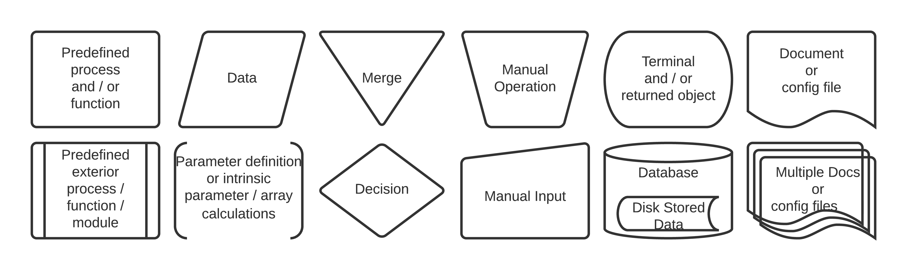
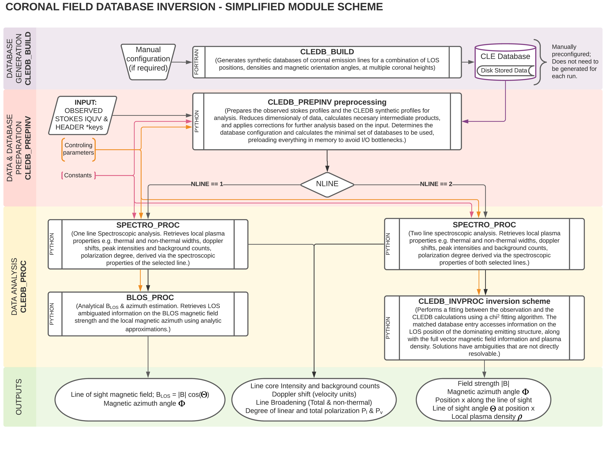

Module Overview Schematic
=========================

Algorithm Flowchart Definitions
-------------------------------

Firstly, we illustrate our definitions for the flowcharts describing different algorithm operations. We note that the flowcharts are not exhaustive and are not meant to describe the code to the level of individual operations. The flowcharts list the main variables and functions used along with how they are processed by the different modules and intrinsic functions, and the resulting outputs. 

The CLEDB Modules
-----------

The CLEDB algorithm is split into three parts: 

* ``CLEDB_BUILD`` - The BUILD module contains pre-configured scripts for generating a database used downstream to fit the observations. FORTRAN binaries and bash scripting is used by this module. Running the default configured ``rundb_1line.sh`` script for each line of your observation is enough in most cases. Please see the dedicated :ref:`readme-rundb-label` for more detailed instructions. 
 
* ``CLEDB_PREPINV`` - The PREPINV module prepares the data for analysis and matches required databases to read into memory (for the 2-line branch). The ``ctrlparams`` and ``constants`` classes are imported separately and fed to the module.

* ``SPECTRO_PROC``, ``BLOS_PROC``, and/or ``CLEDB_INVPROC`` are the data analysis modules. These perform analytical or database inversion schemes on the input observational data to recover the desired plasma and magnetic field parameters (e.g. the ``OUTPUTS``). The main :ref:`readme-main-label` contains instructions on how to end-to-end run the provided examples.

The above module schematic presents the modules along with the main inputs and outputs. Each module is described separately in the following sections. The most important variables and defined functions are described for each inversion module component. The definitions and accompanying diagrams are not meant to be 1:1 mirrors of the coding, but merely to trace the most crucial operations and resulting outputs. Common terminology is defined in the last section. 

.. note::
	Additional extended comments can be found in each module's scripts.